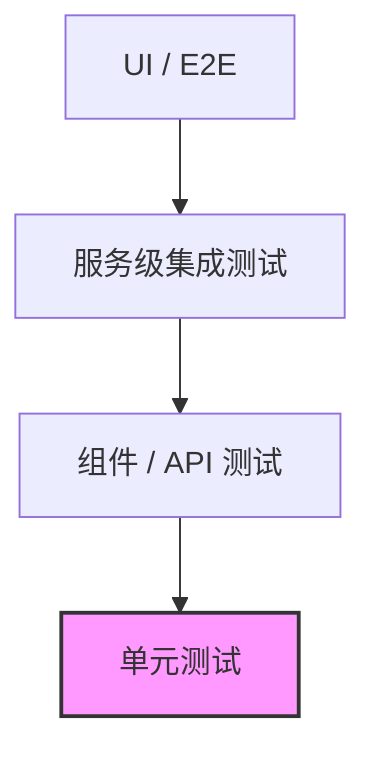

# 测试指南


---

## 目录

- [测试指南](#测试指南)
  - [目录](#目录)
  - [测试金字塔概览](#测试金字塔概览)
  - [主要测试框架及场景](#主要测试框架及场景)
  - [单元测试样板](#单元测试样板)
    - [1. 纯业务类测试](#1-纯业务类测试)
    - [2. 使用 Mockito Mock 依赖](#2-使用-mockito-mock-依赖)
  - [Spring Boot 组件测试样板](#spring-boot-组件测试样板)
    - [1. `@WebMvcTest` – Controller 层](#1-webmvctest--controller-层)
    - [2. `@DataJpaTest` – Repository 层](#2-datajpatest--repository-层)
  - [集成测试样板（Testcontainers）](#集成测试样板testcontainers)
    - [1. 基础容器配置](#1-基础容器配置)
    - [2. 容器生命周期管理](#2-容器生命周期管理)
      - [重启容器（每个测试方法独立）](#重启容器每个测试方法独立)
      - [共享容器（测试类级别）](#共享容器测试类级别)
    - [3. Spring Boot 3.1+ ServiceConnection 简化配置](#3-spring-boot-31-serviceconnection-简化配置)
      - [传统配置方式](#传统配置方式)
      - [ServiceConnection 简化配置（推荐）](#serviceconnection-简化配置推荐)
    - [4. 多容器编排](#4-多容器编排)
    - [5. 容器等待策略](#5-容器等待策略)
    - [6. 单例容器模式（性能优化）](#6-单例容器模式性能优化)
    - [7. Testcontainers 最佳实践](#7-testcontainers-最佳实践)
      - [依赖配置](#依赖配置)
      - [性能优化技巧](#性能优化技巧)
      - [常见陷阱与解决方案](#常见陷阱与解决方案)
  - [外部服务 Mock（WireMock）](#外部服务-mockwiremock)
  - [异步场景测试（Awaitility）](#异步场景测试awaitility)
  - [测试最佳实践清单](#测试最佳实践清单)
    - [通用原则](#通用原则)
    - [Testcontainers 专项实践](#testcontainers-专项实践)
    - [依赖管理](#依赖管理)

---

## 测试金字塔概览



* *单元测试* 数量最多、执行最快；专注于业务逻辑正确性。
* *组件/API 测试* 校验 Spring MVC、Filter、Interceptor 等协作。
* *服务级集成测试* 使用 Testcontainers/WireMock 还原真实依赖环境。
* *UI/E2E* 数量最少，验证端到端用户流程。

> _设计考量：遵循“金字塔”形状可以在保证覆盖率的同时控制测试执行时长。_

---

## 主要测试框架及场景

| 框架 | Maven/Gradle GAV | 适用层级 | 关键能力 |
|------|-----------------|---------|----------|
| **JUnit 5** | `org.junit.jupiter:junit-jupiter:5.10.x` | 所有 | 断言、生命周期管理、参数化测试 |
| **Mockito** | `org.mockito:mockito-core:5.8.x` | 单元 | Mock 依赖对象、行为验证 |
| **Spring Boot Test** | `org.springframework.boot:spring-boot-starter-test:3.2.x` | 组件 | `@WebMvcTest`, `@DataJpaTest`, `@SpringBootTest` |
| **Testcontainers** | `org.testcontainers:junit-jupiter:1.19.x` | 集成 | Docker 化真实依赖（MySQL、Redis…） |
| **WireMock** | `com.github.tomakehurst:wiremock-jre8:3.3.x` | 集成 | HTTP 服务模拟 |
| **Awaitility** | `org.awaitility:awaitility:4.2.x` | 单元/集成 | 等待异步结果 |

---

## 单元测试样板

### 1. 纯业务类测试

```java
@DisplayName("价格计算器 - 单元测试")
class PriceCalculatorTest {

    private final PriceCalculator calculator = new PriceCalculator();

    @ParameterizedTest(name = "场景 {index}: 商品价={0}, 折扣={1}")
    @CsvSource({
        "100,0.0,100",
        "200,0.2,160"
    })
    void should_calculate_price_correctly(BigDecimal price, BigDecimal discount, BigDecimal expected) {
        // when
        BigDecimal actual = calculator.calculate(price, discount);
        // then
        assertThat(actual).isEqualByComparingTo(expected);
    }
}
```

> **为什么这么做**：`@ParameterizedTest` 帮助一次性覆盖多组输入，提升测试覆盖率同时减小样板代码量。

### 2. 使用 Mockito Mock 依赖

```java
@ExtendWith(MockitoExtension.class)
class OrderServiceTest {

    @Mock
    private PaymentGateway paymentGateway;

    @InjectMocks
    private OrderService orderService;

    @Test
    void should_create_order_and_charge_successfully() {
        // given
        Order order = new Order("user-1", BigDecimal.valueOf(99));
        when(paymentGateway.charge(order)).thenReturn(ChargeResult.success());

        // when
        Order result = orderService.create(order);

        // then
        assertThat(result.getStatus()).isEqualTo(Order.Status.PAID);
        verify(paymentGateway).charge(order);
    }
}
```

> _设计考量：Mock 仅针对外部依赖（如支付网关），保持被测类内部逻辑的真实执行。_

---

## Spring Boot 组件测试样板

### 1. `@WebMvcTest` – Controller 层

```java
@WebMvcTest(StationController.class)
class StationControllerTest {

    @Autowired
    private MockMvc mockMvc;

    @MockBean
    private StationService stationService;

    @Test
    void should_return_station_info() throws Exception {
        given(stationService.findById(1L)).willReturn(new StationVO(1L, "上海充电站"));

        mockMvc.perform(get("/stations/1"))
               .andExpect(status().isOk())
               .andExpect(jsonPath("$.name").value("上海充电站"));
    }
}
```

### 2. `@DataJpaTest` – Repository 层

```java
@DataJpaTest
class StationRepositoryTest {

    @Autowired
    private StationRepository repository;

    @Test
    void should_save_and_query_station() {
        StationEntity entity = new StationEntity(null, "杭州充电站");
        repository.save(entity);

        Optional<StationEntity> found = repository.findById(entity.getId());
        assertThat(found).isPresent();
    }
}
```

> _为什么这么做：`@DataJpaTest` 启动嵌入式数据库（H2）且仅扫描 JPA 相关 Bean，启动速度快。_

---

## 集成测试样板（Testcontainers）

### 1. 基础容器配置

```java
@Testcontainers
@SpringBootTest
class StationIntegrationTest {

    @Container
    static MySQLContainer<?> mysql = new MySQLContainer<>(DockerImageName.parse("mysql:8.0.37"))
            .withDatabaseName("station")
            .withUsername("test")
            .withPassword("test");

    @Autowired
    private StationService stationService;

    @Test
    void should_persist_and_query_station_with_real_mysql() {
        StationVO vo = stationService.create("深圳充电站");
        StationVO found = stationService.get(vo.id());
        assertThat(found.name()).isEqualTo("深圳充电站");
    }
}
```

### 2. 容器生命周期管理

#### 重启容器（每个测试方法独立）
```java
@Testcontainers
class RestartedContainerTest {

    // 实例字段 - 每个测试方法都会重启
    @Container
    private final GenericContainer<?> redis = new GenericContainer<>("redis:7-alpine")
            .withExposedPorts(6379);

    @Test
    void test_method_1() {
        // redis 容器为此测试方法启动
        assertThat(redis.isRunning()).isTrue();
    }

    @Test
    void test_method_2() {
        // redis 容器重新启动（全新状态）
        assertThat(redis.isRunning()).isTrue();
    }
}
```

#### 共享容器（测试类级别）
```java
@Testcontainers
class SharedContainerTest {

    // 静态字段 - 整个测试类共享
    @Container
    static PostgreSQLContainer<?> postgres = new PostgreSQLContainer<>("postgres:15-alpine")
            .withDatabaseName("testdb")
            .withUsername("test")
            .withPassword("test");

    @Test
    void test_method_1() {
        // postgres 在第一个测试前启动
        assertThat(postgres.isRunning()).isTrue();
    }

    @Test
    void test_method_2() {
        // 复用同一个 postgres 容器
        assertThat(postgres.isRunning()).isTrue();
    }
}
```

### 3. Spring Boot 3.1+ ServiceConnection 简化配置

#### 传统配置方式
```java
@Testcontainers
@SpringBootTest
class TraditionalRedisTest {

    @Container
    static GenericContainer<?> redis = new GenericContainer<>("redis:7-alpine")
            .withExposedPorts(6379);

    @DynamicPropertySource
    static void configureProperties(DynamicPropertyRegistry registry) {
        registry.add("spring.data.redis.host", redis::getHost);
        registry.add("spring.data.redis.port", () -> redis.getMappedPort(6379));
    }

    @Autowired
    private RedisTemplate<String, String> redisTemplate;

    @Test
    void should_connect_to_redis() {
        redisTemplate.opsForValue().set("key", "value");
        assertThat(redisTemplate.opsForValue().get("key")).isEqualTo("value");
    }
}
```

#### ServiceConnection 简化配置（推荐）
```java
@TestConfiguration
class TestContainerConfig {

    @Bean
    @ServiceConnection(name = "redis")
    GenericContainer<?> redisContainer() {
        return new GenericContainer<>("redis:7-alpine")
                .withExposedPorts(6379);
    }
}

@Testcontainers
@SpringBootTest
@Import(TestContainerConfig.class)
class ServiceConnectionRedisTest {

    @Autowired
    private RedisTemplate<String, String> redisTemplate;

    @Test
    void should_connect_to_redis_automatically() {
        redisTemplate.opsForValue().set("key", "value");
        assertThat(redisTemplate.opsForValue().get("key")).isEqualTo("value");
    }
}
```

### 4. 多容器编排

```java
@Testcontainers
@SpringBootTest
class MultiContainerTest {

    @Container
    static Network network = Network.newNetwork();

    @Container
    static PostgreSQLContainer<?> postgres = new PostgreSQLContainer<>("postgres:15-alpine")
            .withNetwork(network)
            .withNetworkAliases("postgres");

    @Container
    static GenericContainer<?> redis = new GenericContainer<>("redis:7-alpine")
            .withNetwork(network)
            .withNetworkAliases("redis")
            .withExposedPorts(6379);

    @DynamicPropertySource
    static void configureProperties(DynamicPropertyRegistry registry) {
        registry.add("spring.datasource.url", postgres::getJdbcUrl);
        registry.add("spring.datasource.username", postgres::getUsername);
        registry.add("spring.datasource.password", postgres::getPassword);
        registry.add("spring.data.redis.host", redis::getHost);
        registry.add("spring.data.redis.port", () -> redis.getMappedPort(6379));
    }

    @Test
    void should_work_with_multiple_containers() {
        // 测试需要同时使用数据库和缓存的场景
    }
}
```

### 5. 容器等待策略

```java
@Container
static GenericContainer<?> app = new GenericContainer<>("my-app:latest")
        .withExposedPorts(8083)
        .waitingFor(Wait.forHttp("/health")
                .forStatusCode(200)
                .withStartupTimeout(Duration.ofMinutes(2)));

@Container
static GenericContainer<?> database = new GenericContainer<>("postgres:15")
        .withExposedPorts(5432)
        .waitingFor(Wait.forLogMessage(".*database system is ready to accept connections.*", 1))
        .withStartupTimeout(Duration.ofMinutes(1));
```

### 6. 单例容器模式（性能优化）

```java
public class SingletonContainers {

    private static final PostgreSQLContainer<?> POSTGRES;
    private static final GenericContainer<?> REDIS;

    static {
        POSTGRES = new PostgreSQLContainer<>("postgres:15-alpine")
                .withDatabaseName("testdb")
                .withUsername("test")
                .withPassword("test");
        POSTGRES.start();

        REDIS = new GenericContainer<>("redis:7-alpine")
                .withExposedPorts(6379);
        REDIS.start();

        // JVM 关闭时停止容器
        Runtime.getRuntime().addShutdownHook(new Thread(() -> {
            POSTGRES.stop();
            REDIS.stop();
        }));
    }

    public static PostgreSQLContainer<?> getPostgres() {
        return POSTGRES;
    }

    public static GenericContainer<?> getRedis() {
        return REDIS;
    }
}

// 使用单例容器
@SpringBootTest
class FastIntegrationTest {

    @DynamicPropertySource
    static void configureProperties(DynamicPropertyRegistry registry) {
        var postgres = SingletonContainers.getPostgres();
        var redis = SingletonContainers.getRedis();

        registry.add("spring.datasource.url", postgres::getJdbcUrl);
        registry.add("spring.datasource.username", postgres::getUsername);
        registry.add("spring.datasource.password", postgres::getPassword);
        registry.add("spring.data.redis.host", redis::getHost);
        registry.add("spring.data.redis.port", () -> redis.getMappedPort(6379));
    }

    @Test
    void should_reuse_containers_across_test_classes() {
        // 多个测试类共享同一组容器，大幅提升测试套件执行速度
    }
}
```

### 7. Testcontainers 最佳实践

#### 依赖配置
```kotlin
// build.gradle.kts
dependencies {
    // 基础 Testcontainers 支持
    testImplementation("org.testcontainers:junit-jupiter:1.21.3")

    // Spring Boot 3.1+ ServiceConnection 支持
    testImplementation("org.springframework.boot:spring-boot-testcontainers")

    // 专用模块（可选）
    testImplementation("org.testcontainers:postgresql:1.21.3")
    testImplementation("org.testcontainers:kafka:1.21.3")

    // 对于 Redis，使用 GenericContainer 即可，无需专门的依赖
}
```

#### 性能优化技巧
```java
// 1. 使用轻量级镜像
@Container
static GenericContainer<?> redis = new GenericContainer<>("redis:7-alpine"); // 推荐
// static GenericContainer<?> redis = new GenericContainer<>("redis:7"); // 较大

// 2. 合理设置资源限制
@Container
static GenericContainer<?> app = new GenericContainer<>("my-app:latest")
        .withCreateContainerCmdModifier(cmd -> cmd.getHostConfig()
                .withMemory(512 * 1024 * 1024L) // 512MB
                .withCpuCount(1L));

// 3. 预热容器镜像
static {
    // 在静态块中预先拉取镜像
    DockerImageName.parse("postgres:15-alpine").asCanonicalNameString();
}

// 4. 使用网络别名简化容器间通信
@Container
static Network network = Network.newNetwork();

@Container
static GenericContainer<?> app = new GenericContainer<>("my-app:latest")
        .withNetwork(network)
        .withNetworkAliases("app")
        .dependsOn(database);
```

#### 常见陷阱与解决方案
```java
// ❌ 错误：在测试方法中启动容器
@Test
void bad_practice() {
    var container = new GenericContainer<>("redis:7-alpine");
    container.start(); // 每次测试都启动，性能差
}

// ✅ 正确：使用 @Container 注解
@Container
static GenericContainer<?> redis = new GenericContainer<>("redis:7-alpine");

// ❌ 错误：硬编码端口
@DynamicPropertySource
static void configureProperties(DynamicPropertyRegistry registry) {
    registry.add("app.redis.port", () -> "6379"); // 可能冲突
}

// ✅ 正确：使用动态端口
@DynamicPropertySource
static void configureProperties(DynamicPropertyRegistry registry) {
    registry.add("app.redis.port", () -> redis.getMappedPort(6379));
}

// ❌ 错误：忘记等待容器就绪
@Container
static GenericContainer<?> app = new GenericContainer<>("slow-app:latest");

// ✅ 正确：配置等待策略
@Container
static GenericContainer<?> app = new GenericContainer<>("slow-app:latest")
        .waitingFor(Wait.forHttp("/actuator/health").forStatusCode(200));
```

> **设计考量**：
> - 真实容器环境避免了环境不一致问题
> - 静态容器提升性能，实例容器保证隔离
> - ServiceConnection 减少样板代码
> - 合理的等待策略确保容器完全就绪
> - 单例模式适用于测试套件级别的性能优化

---

## 外部服务 Mock（WireMock）

```java
@SpringBootTest(webEnvironment = SpringBootTest.WebEnvironment.RANDOM_PORT)
@Testcontainers
class PricingClientTest {

    @Container
    static GenericContainer<?> pricingService = new GenericContainer<>("wiremock/wiremock:3.3.1")
            .withExposedPorts(8083)
            .withClasspathResourceMapping("pricing-mappings", "/home/wiremock", BindMode.READ_ONLY);

    @Autowired
    private PricingClient pricingClient;

    @Test
    void should_get_price_from_mock_service() {
        BigDecimal price = pricingClient.getPrice("station-1");
        assertThat(price).isEqualByComparingTo("0.66");
    }
}
```

---

## 异步场景测试（Awaitility）

```java
class NotificationServiceAsyncTest {

    private final NotificationService service = new NotificationService();

    @Test
    void should_send_message_async() {
        // when
        service.sendAsync("hello");

        // then
        await().atMost(3, SECONDS)
               .untilAsserted(() -> assertThat(service.getSentMessages()).contains("hello"));
    }
}
```

> _Awaitility 轮询断言，优雅替代 Thread.sleep。_

---

## 测试最佳实践清单

### 通用原则
- **命名规范**：`should_xxx_when_yyy` 明确行为与场景。
- **一个测试只关心一个业务场景**，避免“大杂烩”。
- **保持测试独立**：不依赖执行顺序、不共享状态。
- 使用 **TestDataBuilder** 或 **ObjectMother** 构造复杂对象。
- 针对异常场景编写测试，保证覆盖率>80%。

### Testcontainers 专项实践
- **容器选择**：优先使用官方轻量级镜像（如 `postgres:15-alpine`）。
- **生命周期管理**：静态容器用于性能，实例容器用于隔离。
- **等待策略**：必须配置合适的等待条件，确保容器完全就绪。
- **资源控制**：设置内存和CPU限制，避免测试环境资源耗尽。
- **网络配置**：使用 `Network` 和别名简化容器间通信。
- **Spring Boot 3.1+**：优先使用 `@ServiceConnection` 简化配置。
- **性能优化**：考虑单例容器模式用于大型测试套件。

### 依赖管理
- **Redis 测试**：使用 `GenericContainer` + `spring-boot-testcontainers`，避免第三方依赖。
- **数据库测试**：使用专用模块如 `testcontainers:postgresql`。


